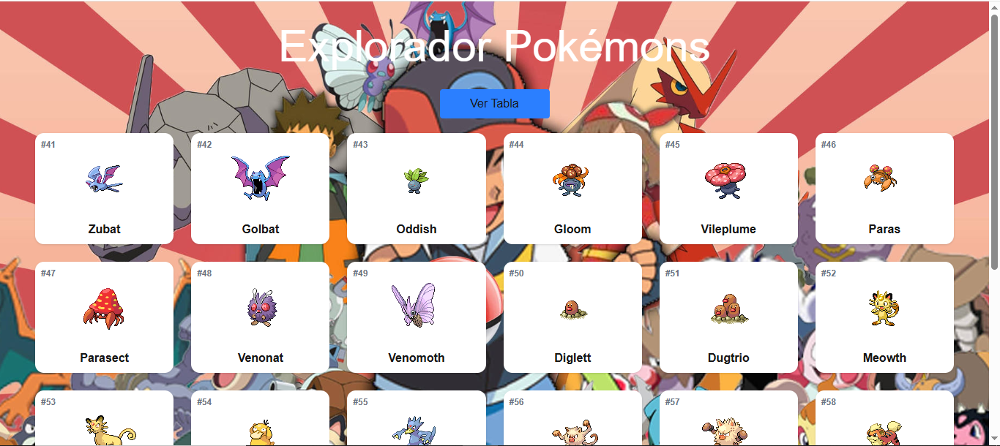
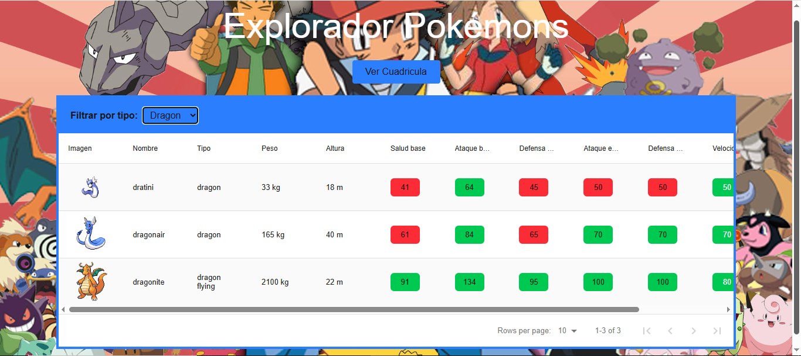
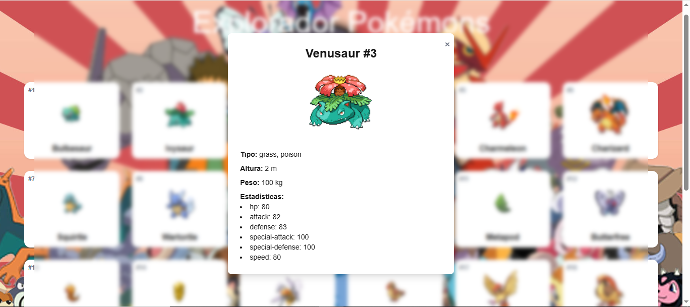
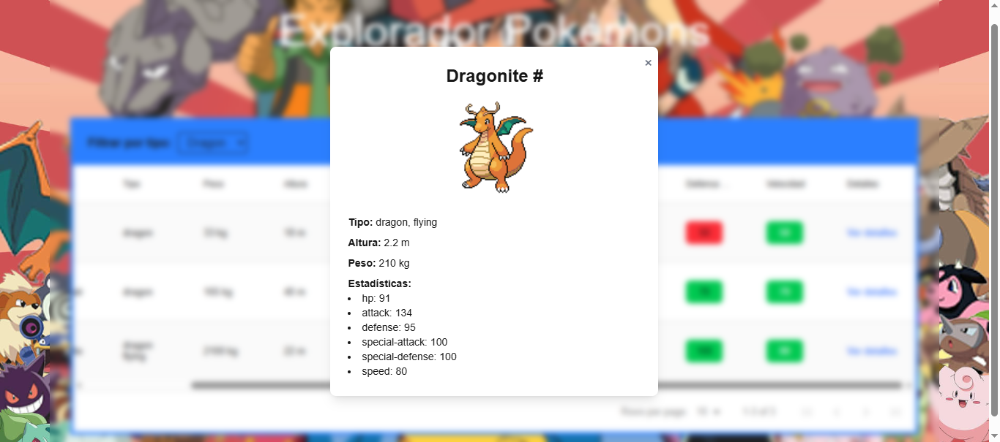

# 🧩 Pokédex (Next.js + TypeScript)

Aplicación web construida con **React (Next.js)** y **TypeScript** que permite explorar **151 Pokémon** mediante una tabla interactiva y una vista en cuadrícula totalmente responsive, los pokemons se pueden ordenar por su nombre, peso, altura, ect, ademas la tabla cuenta con un selector para filtrar segun el tipo de pokemon que se desee visualizar (Agua, Fuego, Hielo, Electricidad) y muchos mas, para ambos casos (grid y tabla) se puede visualizar un modal con mas informacion de cada pokemon dandoles un click sobre ellos. 

---

## 🖼 Captura de pantalla






---

## 🌐 Demo en GitHub Pages

👉 [Ver Pokédex online](https://jesus-gonzalez-arroyo.github.io/Poke-Api/)


---

## 🧰 Tecnologías usadas

- [Next.js](https://nextjs.org/)
- [TypeScript](https://www.typescriptlang.org/)
- [Tailwind CSS](https://tailwindcss.com/)
- [react-data-table-component](https://www.npmjs.com/package/react-data-table-component)
- [PokéAPI](https://pokeapi.co/)

---

## 🚀 Cómo correr el proyecto localmente

1. **Clona el repositorio**

```bash
git clone https://github.com/Jesus-Gonzalez-Arroyo/Poke-Api
cd Poke-Api
code .
```

2. **Instala las dependencias**
```bash
npm install
```

3. **Ejecuta el servidor**
```bash
npm run dev
```